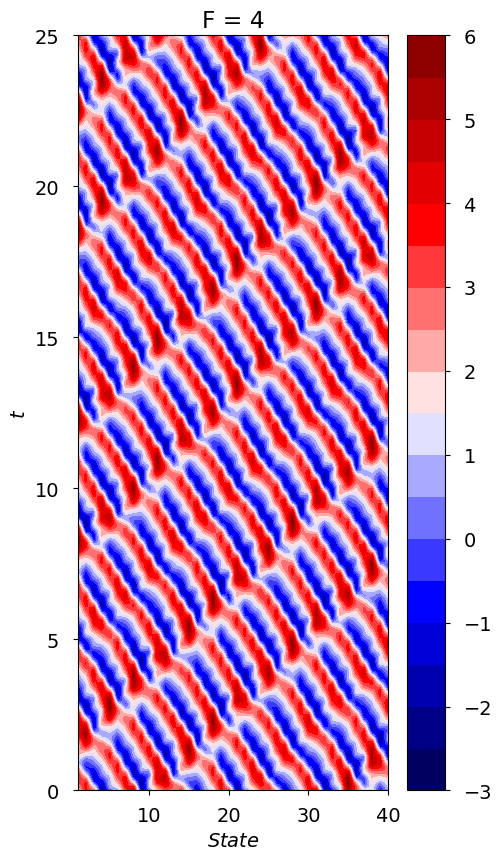
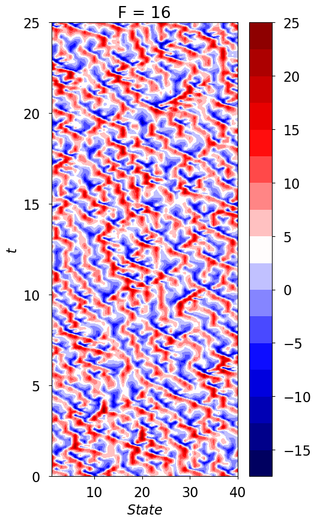
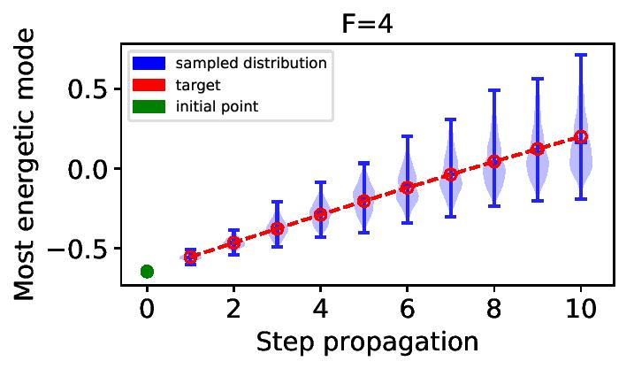
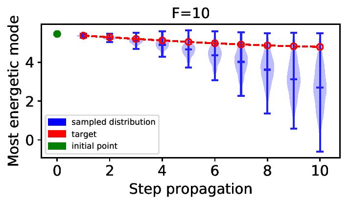
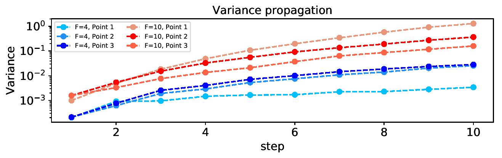

# 01.03-Quantifying-Uncertainty-Lorenz96

This experiment evaluates GP-LSTM's (Gaussian Process regression in combination with LSTM's) on their ability to forecast the predictive distribution of high dimensional chaotic systems.
The GP-LSTM models are built using the keras-gp library (https://github.com/alshedivat/keras-gp) with a matlab engine.

Please check the [README_Lorenz96 File](README_Lorenz96.docx) for detailed instructions on how to run the experiment.
The code was deployed on a computer cluster (ETH Euler Cluster) and is implemented to predict and propagate the individual dimensions of the dynamical system in parallel. MPI is used for message passing between nodes.

**01.03 High Dimensional Lorenz 96 System**

The GP-LSTM architecture is applied for forecasting and uncertainty quantification in the Lorenz 96 model. Lorenz 96 is a chaotic dynamical system developed by Edward N. Lorenz in [34] and describes the behavior in the mid-latitude atmosphere.
Hence, it is often used as a benchmark for weather forecasting methods. 
The differential equations which describe the dynamics of the system
are given by:

 +F

$\frac{\partial X_{j}}{\partial t} \ = \left(X_{j+1}-X_{j-2}\right)X_{j-1}-X_{j}$

The parameter *F* defines the positive external forcing term and *J* the total number of Lorenz states, hence the number of dimensions.

The equation above describes the evolution of the Lorenz 96 states Xj
, components of a spatial discretized atmospheric variable. The discretized energy of the
system remains constant through time. The external forcing term F controls the level of chaos in the dynamic system. It
develops from periodic for F < 1 to weakly chaotic around F = 4 and fully
turbulent around F = 16 and above. The different forcing regimes are depicted in the figures below which are obtained by integrating equations above for J = 40 Lorenz
96 states over 25 time steps with discretization dt = 0.01 i.e. 2500 steps. The
chaotic behavior of the system increases with increasing forcing term F.

 

A propagation algorithm is applied with an optimized GPLSTM for one-step ahead predictions. The model is trained over 1000 epochs
and then utilized to propagate. The procedure is used to propagate samples in
the forcing regimes F = 10 and F = 4. The resulting predictive distributions
propagated over 10 steps for one dimension is shown below.
The uncertainties increase significantly with the future shift as obtained by the
distribution plots in the figure. The true target values are accurately
covered by the estimated confidence bound over 10 time steps for all initial points
and both forcing regimes.

 

The propagated uncertainties are significantly larger
in the weakly chaotic regime F = 4 compared to the stronger forcing F = 10 as
depicted in the figure below.

 
